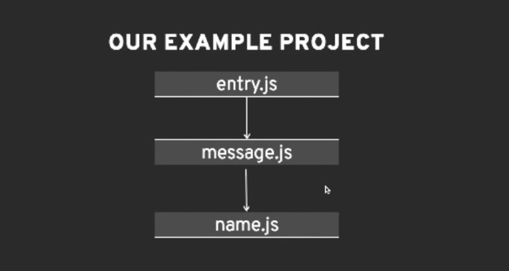

# Build a bundler example 
https://github.com/ronami/minipack/blob/master/src/minipack.js

Implementation Overview
1. Parse a single file and extract its dependencies
2. Recursively build a dependency graph
3. Package everything into a single file

